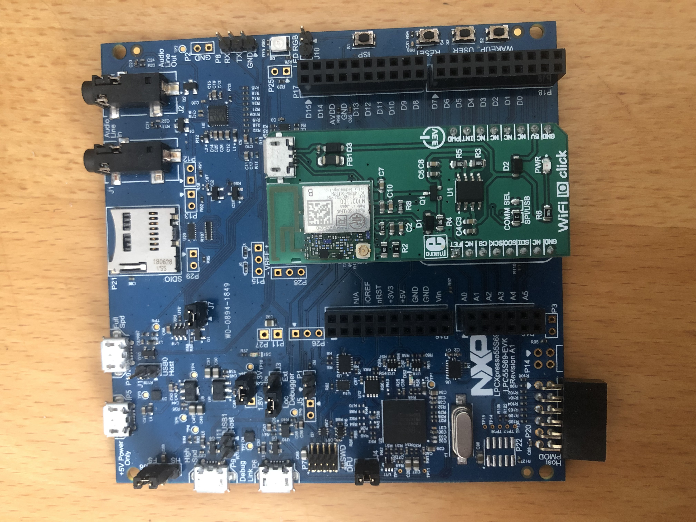
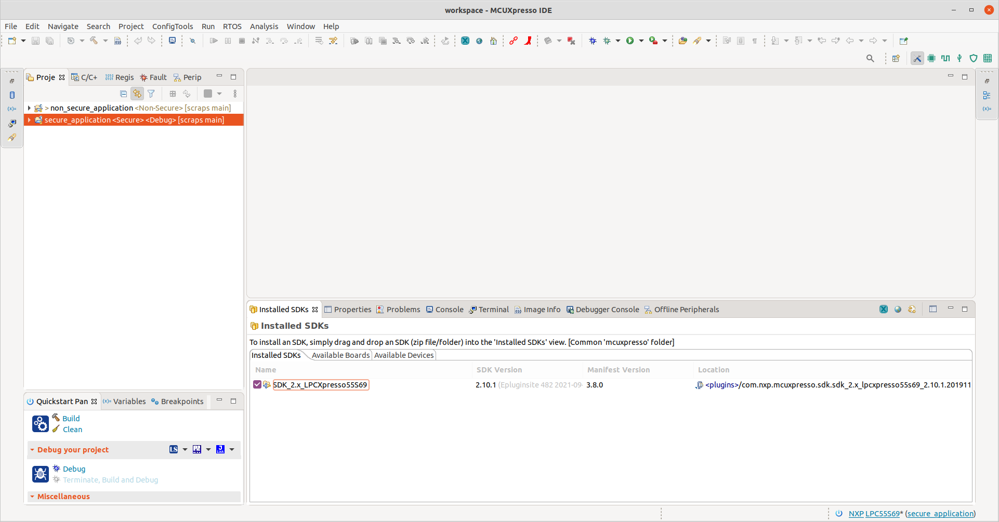
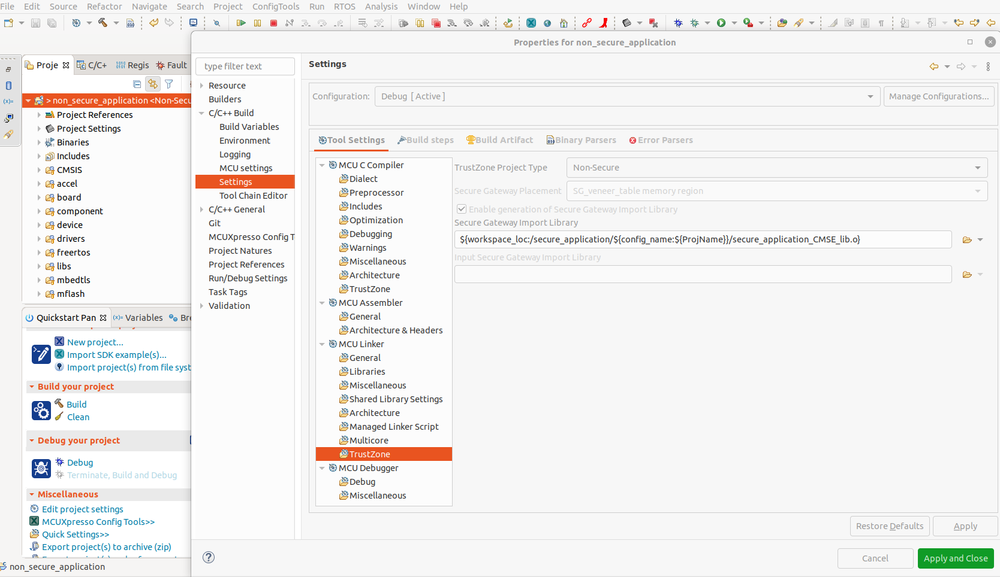
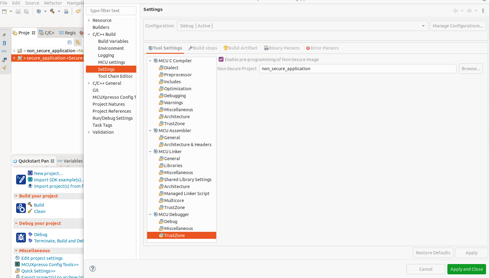

### TrustZone-Based Attestation

#### Hardware 

- LPCXpresso55S69 
- WIFI 10 Click 

#### Software Requirements

- arm-none-eabi
- MCUXpresso IDE v11.4.1 [Build 6260] [2021-09-15]
- SDK_2.x_LPCXpresso55S69 [API version=2.0.0, Format version=3.8]

#### Setup

- Import both application (secure and non secure) as projects in MCUXpresso
- Check that projects are linked as shown in their setting in the following pictures

For Non-Secure App:

For Secure APP:

- Set Wifi credentials on non_secure_application/freertos/demos/include/aws_clientcredential.h
- Set broker topics under non_secure_application/source/remote_control.c 

#### Example
In this example, non_secure_application calls a function from the secure application (running in secure world), to generate a CheckRequest.
The request is built in the secure world as a transaction, signed with the private key( also saved in the secure world). The non_secure_application sends it then to the blockchain using MQTT.

https://user-images.githubusercontent.com/12202616/159741873-60ea77e6-b61d-4d19-8dcc-777f93078bb7.mp4
