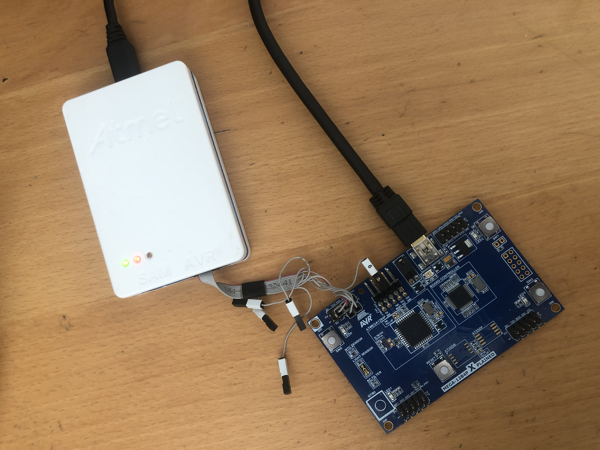

### Microvisor-Based Attestation

#### Hardware 
- ATMega-1284P Xplained
- Atmel ICE

#### Software Requirements

- avrdude 
- avr toolchain

#### Setup

- change directory to IoT-Clients/SCRAPS-ATMEGA/apps/remote_attest
    - Adjust the parameters in the Makefile (e.g. MCU, Frequency, flash, etc.)
    - Run: make microvisor.hex from command line
    - Run: make fuse4 from command line
    - Run: make flash from command line
    - Then, run the python script file verifier.py that serves as a verifier, attaching as parameters the hex file and the serial port of the attached MCU.
